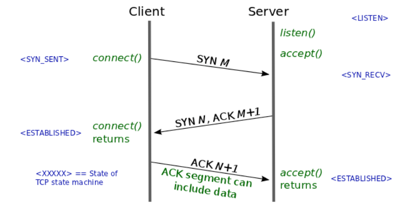
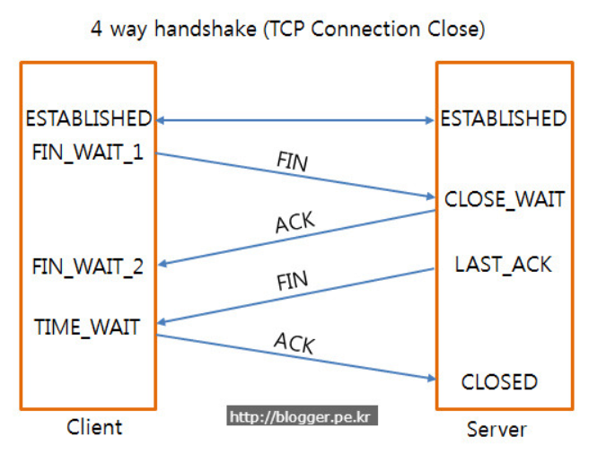

# 3-way-handshake & 4-way-handshake

## 연결 성립(Connection Establishment)

    

1. 클라이언트는 서버에 접속을 요청하는 **SYN(a)** 패킷을 보낸다.
2. 서버는 클라이언트의 요청인 **SYN(a)**을 받고 클라이언트에게 요청을 수락한다는 **ACK(a+1)**와 **SYN(b)**가 설정된 패킷을 발송한다.
3. 클라이언트는 서버의 수락 응답인 **ACK(a+1)**와 **SYN(b)**를 서버로 보내면 연결이 **성립(establish)**된다.

## 연결 해제(Connection Termination)

    

1. 클라이언트가 연결을 종료하겠다는 **FIN플래그**를 전송한다.
2. 서버는 클라이언트의 요청(FIN)을받고 알겠다는 확인 메세지로 **ACK**를 보낸다.
   1. 그리고나서는 데이터를 모두 보낼 때까지 잠깐 **TIME_OUT**이 된다.
3. 데이터를 모두 보내고 통신이 끝났으면 연결이 종료되었다고 클라이언트에게 **FIN 플래그**를 전송한다.
4. 클라이언트는 **FIN 메세지**를 확인했다는 **메세제(ACK)**를 보낸다.
5. 클라이언트의 **ACK 메세지**를 받은 서버는 소켓 **연결을 close**한다.
6. 클라이언트는 아직 서버로 부터 받지 못한 데이터가 있을 것을 대비해 일정 시간 동안 세션을 남겨놓고 잉여 패킷을 기다리는 과정을 거친다.**(TIME_WAIT)**

##### Reference

- [개발자를 위한 Network](https://asfirstalways.tistory.com/356)

